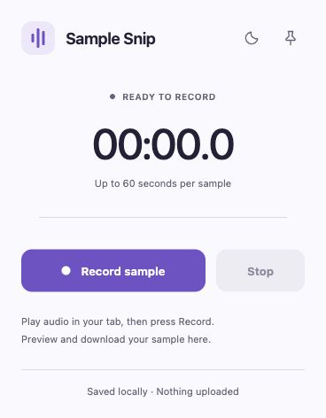
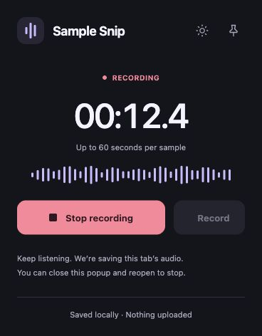

# Sample Snip

A free browser extension that records a short sound from your selected tab. Press **Record sample**, then **Stop**, preview the result, and download **WAV** or **MP3**. Each sample can be up to 60 seconds long.

The pin icon keeps the recorder open in the browser’s side panel while you use the webpage. **Discard** clears your sample. Audio stays on your device.

Light is the default theme. Use the sun/moon button beside the pin icon to switch between light and dark; your choice is remembered for the popup and side panel.

## Screenshots

<p>
  
  
</p>

## Chrome or Edge

1. Choose **Code → Download ZIP** on GitHub and extract it.
2. Open `chrome://extensions` or `edge://extensions`.
3. Enable **Developer mode**, click **Load unpacked**, and select the **extension** folder.
4. Play audio in a tab, open Sample Snip from the toolbar, and record.

No build tools or account are needed. Recording continues if the popup closes; reopen it to Stop, or use the pin icon.

## Firefox beta

With Python 3.10+ installed, run this command from the project folder:

```sh
python3 scripts/package.py
```

On Windows, use `py -3 scripts/package.py` if `python3` is unavailable.

Open `about:debugging`, choose **This Firefox → Load Temporary Add-on**, and select `dist/sample-snip-firefox/manifest.json`. This installation lasts until Firefox restarts.

Play an HTML audio/video player, then open the extension toolbar action before recording. Open it again on each newly selected page to grant access. The pin icon opens Firefox’s sidebar.

## Compatibility

Chrome 116+ and Edge 116+ use full selected-tab audio capture. Firefox 142+ records supported HTML audio/video players in the main page; embedded, cross-origin or protected players, Web Audio games and restrictive page policies may prevent capture. Safari is unsupported.

Chrome and Firefox were tested on macOS. Windows, Linux and Edge still need live browser verification.

## Source

- `extension/` — the extension, with separate Chrome and Firefox backends and shared audio/UI code.
- `scripts/package.py` — creates standalone Chrome and Firefox folders and ZIPs in `dist/`, using only Python’s standard library.
- `docs/` — screenshots and the [privacy policy](docs/privacy.md).

Edit the source directly and reload the extension. There are no npm dependencies, test files or CI setup.

## Privacy and license

Recording, preview and conversion happen locally, with no analytics or audio uploads. Use audio you created or have permission to sample; recording does not grant rights to the source material.

Original code is [MIT licensed](LICENSE). The bundled MP3 encoder retains its LGPL-3.0 license, notices and corresponding source in [extension/vendor](extension/vendor/NOTICE.md). Keep these with redistributed builds. The project is distributed free through GitHub.
